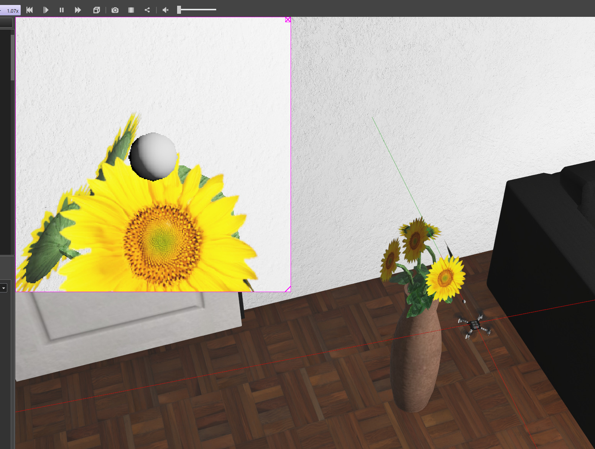

# Crazyflie Pollinate Plants

This project is with the Bristol Robotics Laboratory Proteas group. 
The aim is to use a swarm of micro-uavs to pollinate plants using a touch based approach.

This repository contains the controllers and webots simulation code.

## Setup

### Flight Arena

To be tested

### Simulation

For simulation we use the webot simulator as recommended by Crazyflie. See the following tutorials:

1. https://www.bitcraze.io/documentation/tutorials/getting-started-with-simulation/

The files linked here are a local clone of the wall following example listed. 

To use this, simply run webots, File -> Open World -> Select worlds/crazyflie_apartment.wbt

## This repository

This repo adds a cotton swab to the crazyflie model. 

